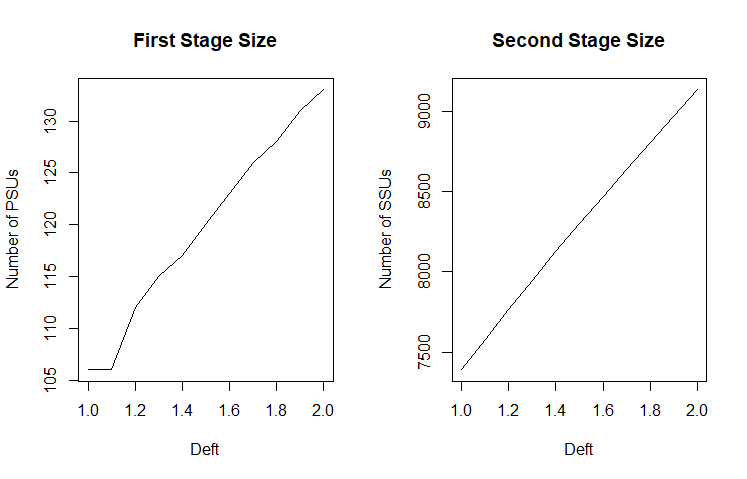
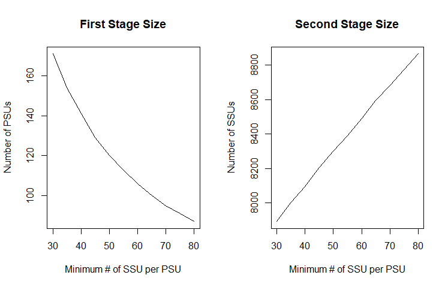
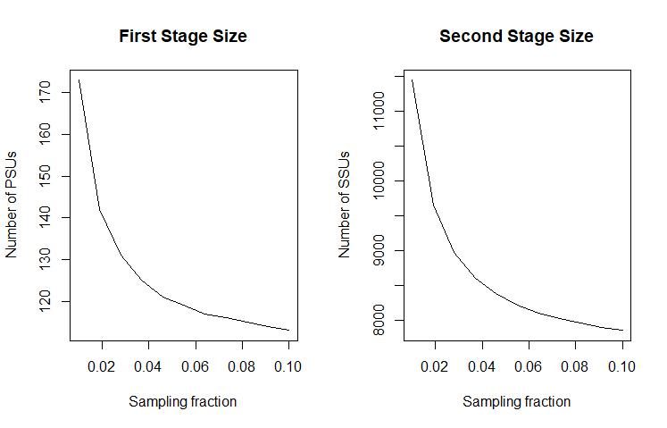

```{r setup, include=FALSE}
options(width=400) 
knitr::opts_chunk$set(echo = TRUE, fig.width=6, fig.height=4)
library(R2BEAT)
options(warn=-1)
options(scipen=9999)
```

This vignette describes a generalized procedure making use of the methods implemented in the R package developed in the Italian National Institute, namely R2BEAT ("Multistage Sampling Allocation and PSU selection").

This package allows to determine the optimal allocation of both Primary Stage Units (PSUs) and Secondary Stage Units (SSU), and also to perform a selection of the PSUs such that the final sample of SSU is of the self-weighting type, i.e. the total inclusion probabilities (as resulting from the product between the inclusion probabilities of the PSUs and those of the SSUs) are near equal for all SSUs, or at least those of minimum variability.

This general flow assumes that a sampling frame is available, containing, among the others, the following variables:

- identifier of the Primary Sampling Units;
- identifier of the Secondary Sampling Units;
- variables identifying the sampling strata;
- target variables, i.e. the variables from which sampling estimates will be produced.

As for the last type of variables, of course their direct availability is not possible: instead, proxy variables will be present in the sampling frame, or the same variables with predicted values.

Having this sampling frame, the workflow is based on the following steps:

1. Loading data and pre-processing
2. Producing the inputs for next steps (with a fine tuning of parameters)
3. Optimal allocation of SSUs in PSUs
4. Selection of PSUs
5. Selection of SSUs

# Loading data and pre-processing

We make use of a synthetic population data frame (pop), that is available at the link:

https://github.com/barcaroli/R2BEAT/tree/master/data

```{r}
load("pop.RData")   
str(pop)
```

In this phase we may have to derive new variables, corresponding to the parameters required by the following steps. In this case, it is not necessary, as almost all the variables are already available. We just have to manipulate in order to derive two target (binary) variables, and add a work variable ('one'):

```{r}
pop$active <- ifelse(pop$work==1,1,0)
pop$inactive <- ifelse(pop$work==2,1,0)
pop$one <- 1
```

Great attention must be paid to the nature of the target variables, especially of the 'factor' type.
In fact, the procedure here illustrated is suitable only when categorical variables are binary with values 0 and 1, supposing we are willing to estimate proportions of '1' in the population.
If factor variables are of other nature, then an error message is printed.

Therefore, we have to handle the 'work' variable in this way: as values 0, 1 and 2 indicate respectively non labour force, active and inactive people, this is why we derived from 'work' the two binary variables, 'active' and 'inactive'.

We are now able to populate the required parameters:

```{r}
samp_frame <- pop
id_PSU <- "municipality"  # only one
id_SSU <- "id_ind"        # only one
strata_var <- "stratum"   # only one
target_vars <- c("income_hh","active","inactive","unemployed")   # more than one
deff_var <- "stratum"     # only one
domain_var <- "region"    # only one
minimum <- 50  # minimum number of SSUs to be interviewed in each selected PSU
delta =  1     # average dimension of the SSU in terms of elementary survey units
f = 0.05          # suggestion for the sampling fraction 
deff_sugg <- 1.5  # suggestion for the deff value
```

# Producing the inputs for next steps

With already assigned parameters, we can execute the 'prepareInputToAllocation' function:

```{r, results='hide'}
inp <- prepareInputToAllocation(samp_frame,
                                id_PSU,
                                id_SSU,
                                strata_var,
                                target_vars,
                                deff_var,
                                domain_var,
                                minimum,
                                delta,
                                f,
                                deff_sugg)
```

The function 'prepareInputToAllocation' produces a list composed by six elements, stored in the 'inp' object:

a) the 'stratif' dataframe containing:

 - STRATUM: identifier of the single stratum
 - N: total population in terms of final sampling units
 - Mi,Si: mean and standard deviation of target variables (i=1,2,..,P) 
 - DOMk: domain(s) to which the stratum belongs
 
b) the 'deff' (design effect) dataframe, containing the following information:

  - STRATUM: the stratum identifier
  - DEFFi: the design effect for each target variable i (i=1,2,...,P)

 
c) the 'effst' (estimator effect) dataframe, containing the following information:

  - STRATUM: the stratum identifier
  - EFFSTi: the estimator effect for each target variable i (i=1,2,...,P)

d) the 'rho' (intraclass coefficient of correlation) dataframe, containing the following information:

  - STRATUM: the stratum identifier
  - RHO_ARi: the intraclass coefficient of correlation in self-representative PSUs for each target variable i (i=1,2,...,P)
  - RHO_NARi: the intraclass coefficient of correlation in non self-representative PSUs for each target variable i (i=1,2,...,P)
  
e) the 'des_file' dataframe, containing the following information:

  - STRATUM: stratum identifier
  - MOS: measure of size of the stratum (in terms of number of contained selection units)
  - DELTA: factor that report the average number of SSUs for each selection unit 
  - MINIMUM: minimum number of units to be selected in each PSU

f) the 'PSU_file' dataframe, containing the following information:

  - stratum identifier
  - PSU id
  - PSU_MOS: number of final selection units contained in a given PSU  

(Actually, the 'deff' dataframe is not used in the following steps, it just remains for documentation purposes.)

Let us see the content of these objects:

```{r}
head(inp$strata)
```

```{r}
inp$deff
```

```{r}
inp$effst
```

```{r}
inp$rho
```

```{r}
inp$des_file
```

```{r}
head(inp$PSU_file)
```

It may happen that the population in strata (variable 'N' in 'inp\$strata' dataset) and the one derived by the PSU dataset (variable 'STRAT_MOS' in 'inp\$des_file' dataset) are not the same.

We can check it by applying the function 'check_input' in this way:

```{r}
newstrata <- check_input(strata=inp$strata,
                         des=inp$des_file,
                         strata_var_strata="STRATUM",
                         strata_var_des="STRATUM")
```


# Fine tuning of the parameters

For the execution of the function 'prepareInputToAllocation' it is necessary to assign values to the different parameters. Some of them can be directly derived by available data, but for others, namely: 

- 'minimum' (minimum number of SSUs to be interviewed in each selected PSU)
- 'f' (suggestion for the sampling fraction) 
- 'deff_sugg'  (suggestion for the deff value)


the indication of the values is more difficult, without having any reference.

In order to orientate in the choice of these values, the function 'sensitivity' allows to perform a sensitivity analysis for each of this parameters.

To execute this function, the name of the parameter has to be given, together with the minimum and maximum value. On the basis of these minimum and maximum values, 10 different values will be used for carrying out the allocation. The output will be a graphical one. 

This function requires also the definition of the precision constraints on the target values:


```{r}
cv <- as.data.frame(list(DOM=c("DOM1","DOM2"),
                         CV1=c(0.03,0.04),
                         CV2=c(0.06,0.08),
                         CV3=c(0.06,0.08),
                         CV4=c(0.06,0.08)))
cv
```

The meaning of these constraints is that, once we select a sample and produce extimates, we expect a maximum coefficient of variation for the first variable ('income_hh') equal to 3\% at national level ('DOM1') and to 4\% at regional level ('DOM2'); respectively 6\% and 8\% for the other three variables.

For instance, we can analyze the impact of the 'deff_sugg' parameter on the final sample design by executing the following code:

```{r, eval=FALSE,results='hide'}
sensitivity (samp_frame=pop,
            errors=cv,
            id_PSU="municipality",
            id_SSU="id_ind",
            strata_var="stratum",
            target_vars=c("income_hh","active","inactive","unemployed"),
            deff_var="stratum",
            domain_var="region",
            minimum=50,
            delta=1,
            f=0.05,
            search="deff",
            min=1,
            max=2) 
```

```{r, eval=TRUE,echo=FALSE}

```


The same for the 'minimum' parameter:

```{r, eval=FALSE,results='hide'}
sensitivity (samp_frame=pop,
            id_PSU="municipality",
            id_SSU="id_ind",
            strata_var="stratum",
            target_vars=c("income_hh","active","inactive","unemployed"),
            deff_var="stratum",
            domain_var="region",
            delta=1,
            f=0.05,
            deff_sugg=1.5,
            search="min_SSU",
            min=30,
            max=80) 
```


```{r , eval=TRUE,echo=FALSE}

```

And, finally, for initial sampling rate:

```{r, eval=FALSE,results='hide'}
sensitivity (samp_frame=pop,
            id_PSU="municipality",
            id_SSU="id_ind",
            strata_var="stratum",
            target_vars=c("income_hh","active","inactive","unemployed"),
            deff_var="stratum",
            domain_var="region",
            delta=1,
            minimum=50,
            deff_sugg=1.5,
            search="sample_fraction",
            min=0.01,
            max=0.10) 
```

```{r, eval=TRUE,echo=FALSE}

```


By analysing the above graphs we can decide which values are the most suitable for the sample design.

# Optimal allocation

Using the function 'beat.2st' in 'R2BEAT' package we can perform the optimization of PSU and SSU allocation in strata:

```{r}
alloc <- beat.2st(inp$strata, 
                  cv, 
                  inp$des_file, 
                  inp$psu_file, 
                  inp$rho, 
                  deft_start = NULL, 
                  inp$effst,
                  epsilon1 = 5, 
                  mmdiff_deft = 1,
                  maxi = 15, 
                  epsilon = 10^(-11), 
                  minnumstrat = 2, 
                  maxiter = 200, 
                  maxiter1 = 25)
```

This is the sensitivity of the solution:

```{r}
alloc$sensitivity
```

i.e., for each domain value and for each variable it is reported the gain in terms of reduction in the sample size if the corresponding precision constraint is reduced of 10\%.

These are the expected values of the coefficients of variation:

```{r}
alloc$expected
```


# Selection of PSUs

Using the function 'StratSel' execute the selection of PSU in strata:

```{r}
set.seed(1234)
allocat <- alloc$alloc[-nrow(alloc$alloc),]
sample_2st <- StratSel(dataPop= inp$psu_file,
                       idpsu= ~ PSU_ID, 
                       dom= ~ STRATUM, 
                       final_pop= ~ PSU_MOS, 
                       size= ~ PSU_MOS, 
                       PSUsamplestratum= 1, 
                       min_sample= minimum, 
                       min_sample_index= FALSE, 
                       dataAll=allocat,
                       domAll= ~ factor(STRATUM), 
                       f_sample= ~ ALLOC, 
                       planned_min_sample= NULL, 
                       launch= F)
```

This is the overall sample design:

```{r}
sample_2st[[2]]
```


```{r, echo=TRUE}
des <- sample_2st[[2]]
des <- des[1:(nrow(des)-1),]
strat <- c(as.character(as.numeric(des$Domain[1:(nrow(des)-1)])),"Tot")
barplot(t(des[1:(nrow(des)),2:3]), names=strat,
        col=c("darkblue","red"), las=2, xlab = "Stratum", cex.axis=0.7, cex.names=0.7)
legend("topleft", 
       legend = c("Self Representative","Non Self Representative"),
       fill = c("darkblue", "red"))
title("Distribution of allocated PSUs by domain")

```

```{r, echo=TRUE}
barplot(t(des[1:(nrow(des)),5:6]), names=strat,
        col=c("darkblue","red"), las=2, xlab = "Stratum", cex.axis=0.7, 
        cex.names=0.7)
legend("topleft", 
       legend = c("Self Representative","Non Self Representative"),
       fill = c("darkblue", "red"))
title("Distribution of allocated SSUs by domain")
```

and these are the selected PSUs:

```{r}
selected_PSU <- sample_2st[[4]]
selected_PSU <- selected_PSU[selected_PSU$PSU_final_sample_unit > 0,]
write.table(sample_2st[[4]],"Selected_PSUs.csv",sep=";",row.names=F,quote=F)
head(selected_PSU)
```

# Selection of SSUs

Finally, we are able to select the Secondary Sample Units (the individuals) from the already selected PSUs (the municipalities). 
First, we load the population frame:

```{r}
load("pop.RData")
```

and we proceed to select the sample in this way:

```{r}
samp <- select_SSU(df=pop,
                   PSU_code="municipality",
                   SSU_code="id_ind",
                   PSU_sampled=selected_PSU[selected_PSU$Sampled_PSU==1,],
                   verbose=FALSE)
```

To check that the total amount is practically equal to what determined in the allocation step:

```{r}
nrow(samp)
sum(allocat$ALLOC)
```

and that the sum of weights equalize population size:

```{r}
nrow(pop)
sum(samp$weight)
```
This is the distribution of weights:

```{r}
par(mfrow=c(1, 2))
boxplot(samp$weight,col="orange")
title("Weights distribution (total sample)",cex.main=0.7)
boxplot(weight ~ region, data=samp,col="orange")
title("Weights distribution by region",cex.main=0.7)
boxplot(weight ~ province, data=samp,col="orange")
title("Weights distribution by province",cex.main=0.7)
boxplot(weight ~ stratum, data=samp,col="orange")
title("Weights distribution by stratum",cex.main=0.7)
```

It can be seen that the sample is fully self-weighted inside strata, and approximately self-weighted in aggregations of strata, that is the result we wanted to obtain.


